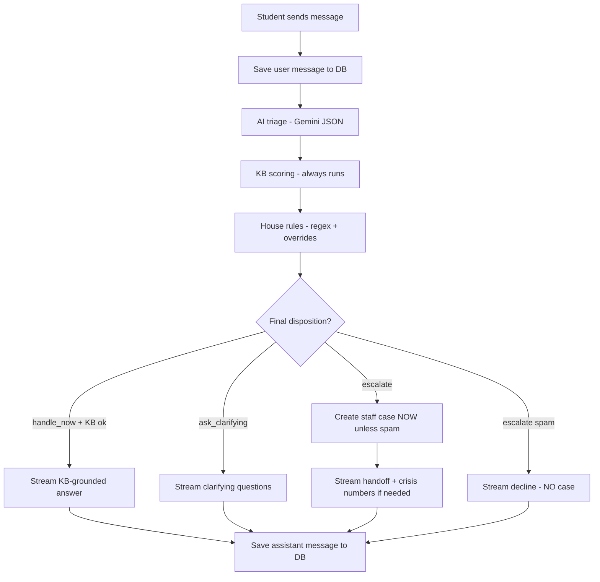

# AI Welfare Assistant

A conversational AI welfare assistant for university student support. Students chat in natural language; the server triages each message, applies safeguarding house rules in code, and either answers from a knowledge base, asks a clarifying question, or escalates to staff.

## Live demo

Deploy with `vercel deploy`, then set your production URL here (e.g. `https://your-app.vercel.app`).

## Staff login (assessment)

- URL: `/dashboard/login`
- Email: `staff@example.com`
- Password: `StaffPass123!`

## Local setup

### Prerequisites

- Node.js 18+
- A [Neon](https://neon.tech) PostgreSQL database (free tier)
- A [Google AI Studio](https://aistudio.google.com/apikey) API key for Gemini

### 1. Clone and install

```bash
git clone <your-repo-url>
cd eduinuk_assisment
npm install
```

### 2. Environment variables

Copy `.env.example` to `.env.local` and fill in:

```env
DATABASE_URL=postgresql://...-pooler...?sslmode=require
GOOGLE_GENERATIVE_AI_API_KEY=your-key
GEMINI_MODEL=gemini-3-flash-preview
BETTER_AUTH_SECRET=$(openssl rand -base64 32)
BETTER_AUTH_URL=http://localhost:3000
```

Use Neon's **pooled** connection string (hostname contains `-pooler`).

### 3. Database

```bash
npm run db:migrate
npm run db:seed
```

### 4. Run

```bash
npm run dev
```

Open [http://localhost:3000/chat](http://localhost:3000/chat) for the student experience, or [http://localhost:3000/dashboard/login](http://localhost:3000/dashboard/login) for staff.

### 5. Verify auth

```bash
curl http://localhost:3000/api/auth/ok
# → {"status":"ok"}
```

### 6. Test house rules

```bash
npx tsx scripts/test-scenarios.ts
```

## Architecture

**Stack:** Next.js 16, Neon PostgreSQL, Drizzle ORM, Better Auth, Gemini via Vercel AI SDK, AI Elements + shadcn/ui.

The staff dashboard is server-rendered (RSC) with a server action for case status updates — no client-side data-fetch waterfalls.

### How a student message is handled

Every time a student sends a message, the server runs the same pipeline. The AI suggests what to do; fixed safety rules in code always have the final say.



#### Step-by-step

| Step | What happens | Why |
|------|----------------|-----|
| 1. Save user message | The student's text is written to the database immediately | So nothing is lost if the AI fails later |
| 2. AI triage | Gemini classifies the message: topic, urgency, safeguarding risk, and a suggested action (`handle_now`, `ask_clarifying`, or `escalate`) | AI is good at understanding varied wording |
| 3. KB scoring | The message is matched against static knowledge-base articles (keyword + category scoring) | Decides whether we actually have content to answer from |
| 4. House rules | Server-side regex and logic override the AI when needed (crisis, immigration, harassment, vague messages, KB gaps, spam) | Safety rules can't be jailbroken like a prompt can |
| 5. Save triage audit | Both the AI's raw output and the final decision are stored | Staff can see what the AI suggested vs what the server enforced |
| 6. Side effects | Clarifying counter increments, or a staff case is created **on this message** (not at end of chat) | Staff get notified as soon as something needs human attention |
| 7. Stream reply | The assistant response is streamed to the student | Good chat UX |
| 8. Save assistant message | The full reply (and KB source links if any) is saved after streaming finishes | Complete conversation history for staff |

#### Before the first message: starting a chat

1. Student enters name and email on `/chat`.
2. `POST /api/conversations` creates a row in the database and returns a `conversationId`.
3. The browser stores that ID in `sessionStorage` — no student login required.

#### AI triage (step 2)

Gemini returns structured JSON (validated with Zod), not a reply to the student:

- **Category** — academic, financial, visa/immigration, housing, health/wellbeing, other
- **Urgency** — low, medium, high, critical
- **Safeguarding** — is someone at risk?
- **Disposition** — answer now, ask for more detail, or escalate to staff

If triage times out or fails, the safe default is **escalate** — never guess when the AI is unavailable.

#### KB scoring (step 3)

KB scoring answers: *"Do we have an article that actually matches what they asked?"*

- Scores each article in `lib/knowledge-base/articles.ts` using category match, tag overlap, and summary keywords.
- Returns the top articles plus `canAnswer: true/false`.
- If AI says "answer it" but KB says "we have nothing good" → house rules force **escalate** (`kb_gap`).
- KB articles are only shown as sources on grounded `handle_now` replies.

#### House rules (step 4)

Fixed rules in `lib/ai/house-rules.ts` and `lib/ai/signals.ts` always run after triage. Examples:

| Signal | What happens |
|--------|----------------|
| Immediate danger (e.g. self-harm, "right now") | Escalate, emergency banner, crisis numbers — AI output ignored |
| Crisis / safeguarding | Force escalate, bump urgency |
| Personal immigration (visa, CAS, sponsor) | Always escalate — no individual immigration advice |
| Legal advice, harassment | Escalate |
| Vague message ("hi", "help") | Ask 1–2 clarifying questions (max 2 rounds, then escalate) |
| Spam / jailbreak | Polite decline — **no staff case** |
| AI said handle_now but KB can't answer | Escalate |

**Design principle:** AI proposes, server disposes.

#### What each final disposition means

| Disposition | Staff case? | What the student sees |
|-------------|-------------|------------------------|
| `handle_now` (KB matched) | No | Helpful answer with source links |
| `ask_clarifying` | No | 1–2 questions to understand the issue |
| `escalate` | Yes (unless spam) | Empathetic handoff; team will contact them by email |
| `escalate` (spam) | No | Brief decline |

Cases are created **per escalated message**, before the reply finishes streaming — not after the conversation ends.

#### Staff dashboard flow

1. Staff log in at `/dashboard/login` (Better Auth).
2. Open cases are loaded server-side from Postgres, sorted by priority (safeguarding + urgency).
3. Staff open a case to see the full conversation, triage history, and update status (`new` → `in_progress` → `resolved`).

## Known limitation (assessment build)

Staff sign-up via email/password is enabled for easy local setup. In production this would be disabled (`disableSignUp: true`), with invite-only staff accounts and role-based access on dashboard routes.

## Deploy to Vercel

1. Push to GitHub and import in [Vercel](https://vercel.com).
2. Add environment variables (`DATABASE_URL`, `GOOGLE_GENERATIVE_AI_API_KEY`, `BETTER_AUTH_SECRET`, `BETTER_AUTH_URL` = your production URL).
3. Run migrations against production: `npm run db:migrate`
4. Seed staff: `npm run db:seed`

## Assessment questions

### If this served 50 organisations and 10,000 conversations a day, what would you change?

Move triage and case creation to background workers, isolate each org's data, add rate limits, and cache KB matching. Use read replicas and archive old conversations. Run a fast/cheap model for triage only, with logging and alerts when safeguarding cases spike.

### This is real students' personal and welfare data. What would you do differently for privacy and safety in a production version?

Encrypt data, store only what's needed, and give students a clear privacy notice and deletion process. Limit staff access with roles and audit logs — especially for safeguarding cases. Keep secrets in a managed store, sign DPAs with providers, and run regular security testing.

### How does the assistant decide what to answer itself and what to escalate?

AI classifies each message; fixed server rules have the final say. It answers itself when there's a matching KB article. It asks clarifying questions for vague messages (max two rounds). It escalates for crisis, safeguarding, immigration, legal issues, harassment, KB gaps, or uncertainty — with emergency numbers when needed. Spam gets a polite decline with no staff ticket.

## Submission notes

- Spam/jailbreak messages are declined safely and do **not** create staff cases (by design).
- Immigration questions always escalate; the assistant may link to GOV.UK but never advises on individual circumstances.
- KB sources appear only on grounded `handle_now` replies (not on escalate/clarify).
- All 8 test messages from the assessment brief are covered in `scripts/test-scenarios.ts`.
